# High level design

```mermaid
---
config:
  layout: dagre
  theme: dark
---
flowchart TD
    %% User Layer
    USER[👤 Users]
    
    %% Client Layer
    subgraph client["🌐 Client Layer"]
        WEB["📱 Web/Mobile Client<br/>React/Flutter"]
        DNS["🌍 DNS Resolution"]
    end
    
    %% Edge Layer
    subgraph edge["⚡ Edge Layer"]
        CDN["🚀 AWS CloudFront<br/>• Static Assets<br/>• Global Distribution"]
    end
    
    %% Application Layer
    subgraph app["🏗️ Application Layer"]
        direction TB
        
        subgraph api["FastAPI Server"]
            NGINX["⚖️ Nginx Reverse Proxy<br/>• SSL Termination<br/>• Rate Limiting<br/>• Request Routing"]
            
            MIDDLEWARE["🛡️ Middleware Pipeline<br/>• Authentication<br/>• CORS<br/>• Request Validation"]
            
            subgraph services["Core Services"]
                AUTH["🔐 Auth Service<br/>• JWT Tokens<br/>• OTP Verification<br/>• Session Management"]
                USER_SVC["👥 User Service<br/>• Profile Management<br/>• Preferences"]
                FILE_SVC["📁 File Service<br/>• Upload/Download<br/>• S3 Integration"]
                NOTIF["🔔 Notification Service<br/>• Real-time SSE<br/>"]
            end
            
            ROUTERS["🛣️ API Routes<br/>• RESTful Endpoints<br/>• OpenAPI Docs"]
        end
    end
    
    %% Data Layer
    subgraph data["💾 Data Layer"]
        MONGO[("🍃 MongoDB<br/>Primary Database<br/>• Users & Profiles<br/>• Sessions<br/>• Notifications<br/>• File Metadata")]
        
        S3[("☁️ AWS S3<br/>Object Storage<br/>• User Files<br/>• Generated Reports<br/>• Media Assets")]
    end
    
    %% External Services
    subgraph external["🌍 External Services"]
        TWILIO["📱 Twilio<br/>SMS Gateway<br/>• OTP Delivery<br/>• Notifications"]
        
      %%   EMAIL["📧 Email Service<br/>SendGrid/SES<br/>• Transactional Emails<br/>• Notifications"]
    end
    
    %% Monitoring & DevOps
    %% (Removed as requested)

    %% User Flow
    USER --> WEB
    USER --> DNS
    
    %% Client to Edge
    WEB --> CDN
    WEB --> NGINX
    DNS --> NGINX
    
    %% Edge to Application
    CDN -.->|Static Assets| S3
    CDN --> NGINX
    NGINX --> MIDDLEWARE
    
    %% Application Flow
    MIDDLEWARE --> ROUTERS
    ROUTERS --> AUTH
    ROUTERS --> USER_SVC
    ROUTERS --> FILE_SVC
    ROUTERS --> NOTIF
    
    %% Service to Data
    AUTH --> MONGO
    USER_SVC --> MONGO
    FILE_SVC --> S3
    FILE_SVC --> MONGO
    NOTIF --> MONGO
    
    %% External Integrations
    AUTH --> TWILIO
%%     NOTIF --> EMAIL
    
    %% Enhanced Styling
    classDef userStyle fill:#E1F5FE,stroke:#0277BD,stroke-width:3px,color:#01579B
    classDef clientStyle fill:#F3E5F5,stroke:#7B1FA2,stroke-width:2px,color:#4A148C
    classDef edgeStyle fill:#E8F5E8,stroke:#2E7D32,stroke-width:2px,color:#1B5E20
    classDef appStyle fill:#FFF3E0,stroke:#F57C00,stroke-width:2px,color:#E65100
    classDef serviceStyle fill:#E3F2FD,stroke:#1976D2,stroke-width:2px,color:#0D47A1
    classDef dataStyle fill:#E8F5E8,stroke:#388E3C,stroke-width:3px,color:#1B5E20
    classDef externalStyle fill:#FCE4EC,stroke:#C2185B,stroke-width:2px,color:#880E4F
    classDef containerStyle fill:#263238,stroke:#37474F,stroke-width:2px,color:#ECEFF1
    
    class USER userStyle
    class WEB,DNS clientStyle
    class CDN edgeStyle
    class NGINX,MIDDLEWARE,ROUTERS appStyle
    class AUTH,USER_SVC,FILE_SVC,NOTIF serviceStyle
    class MONGO,S3 dataStyle
    class TWILIO,EMAIL externalStyle
    class client,edge,app,api,services,data,external containerStyle
```

---

# Database design

# Design decisions
### Initial architectural decisions and why FastAPI
> The core architecture is a stateless RESTful API. To manage user state, I implemented a server-side session management system instead of using client-side JWTs. While JWTs are popular, they cannot be easily revoked before their expiration. In a medical application, the ability to immediately terminate a user's session from the server
> 
> #### **I chose FastAPI because**
> - **Performance:** Its asynchronous nature, built on [ASGI](https://asgi.readthedocs.io/en/latest/), offered significant performance advantages over traditional frameworks like Flask, ensuring a responsive user experience.
> - **Data Integrity:** FastAPI's native integration with Pydantic for data validation was critical. For a medical platform, enforcing strict data schemas at the API boundary is essential to maintain the integrity of patient and medical data.
> - **Developer Experience:** The automatic generation of interactive API documentation (Swagger UI) streamlined development and testing, which was a huge benefit for building the API from the ground up.

### Why custom session handler
> This has a slightly humorous side to it as to why did I write a session handler when plenty of libraries already exist?
> - I needed a simple handler and felt it was more reasonable to write my own than to add more dependencies. Being new to Python development, I wasn’t sure which library to use, and after analyzing the complexity, I found it easier to write my own than to go through the documentation of a third-party library.
> - I was also very clear about my requirements, and since I understood how middleware works, implementing myself wasn't too hard.

### Role based access-control and limited access
> Sharing medical resource was the core purpose of this project. Having a role-based system to share resources was perfect to grant limited access to files.
> 
> For example a patient could grant file read access to the doctor he/she is seeing. They could even set period of time the file can be accessed.
> 
> For this purpose I used S3 pre-signed URLs with expiration period.
> 
> There were bascially two types of access to be shared a temporary access and a permanent access. Both files were accessed through signed urls. For temporary the new urls won't get generated after it's expiration.

### Rate limit Twilio requests
> So Twilio was one of the most expensive service but reliable too. To ensure user couldn't spam OTP request a cooldown period was introduced to rate-limit the requests.

### Using Server-Sent Events
> So WebSockets were also an option for sending notifications. Since the rquirement was to only send messages, a simplex connection like SSE was a better choice.

### Using NGINX for reverse proxy
> I had experience with NGINX so it became my first choice to use while configuring a reverse proxy.
> 
> **What it does**
> - SSL termination: All the https requests were handled at this layer and converted to HTTP for the servers. It provided a central point to verify requests which made scaling and adding multiple servers easier by avoiding multiple certificates for different servers.
> - Rate-Limitting
> 
> At present a single server is enough to cater the users but when multiple servers were deployed an optimisation to the reverse proxy could improve session connectivity by implementing [sticky sessions](https://www.imperva.com/learn/availability/sticky-session-persistence-and-cookies/).

### Why MongoDB
> Simple answer: Flexible(good for document based data), schema-less design and scalable.

# 🚀 Auravita API Documentation

> **FastAPI-powered healthcare platform API** with secure authentication, user management, and real-time notifications.

## 📋 Table of Contents
- [Authentication](#-authentication)
- [User Management](#-user-management)
- [Resource & File Management](#-resource--file-management)
- [Notifications](#-notifications)
- [Security & General Notes](#-security--general-notes)

---

## 🔐 Authentication
*Base URL: `/auth`*

All authentication endpoints handle user registration, login with OTP verification, and session management.

| Method | Endpoint | Description | Request Body | Response |
|--------|----------|-------------|--------------|----------|
| `POST` | `/auth/signup` | Register new user and send OTP | `{ phone, name, role }` | `{ id, message }` |
| `POST` | `/auth/signup/verify/{id}` | Verify OTP during signup | `{ otp }` | `{ success, session }` |
| `POST` | `/auth/signin` | Initiate login and send OTP | `{ phone }` | `{ id, message }` |
| `POST` | `/auth/signin/verify/{id}` | Verify OTP for login | `{ otp }` | `{ success, session }` |
| `POST` | `/auth/signin/resendotp` | Resend OTP for login | `{ phone }` | `{ success, message }` |
| `POST` | `/auth/signup/resendotp` | Resend OTP for signup | `{ phone }` | `{ success, message }` |
| `POST` | `/auth/signout` | Logout and clear session | - | `{ success }` |

### 📱 OTP Flow
1. User initiates signup/signin
2. API generates OTP and sends via Twilio SMS
3. API returns verification ID to user
4. User submits OTP with verification ID
5. API validates and creates session cookie

---

## 👥 User Management
*Base URL: `/protected/user`* 🔒

Comprehensive user profile management, doctor-patient connections, and search functionality.

### Profile Management
| Method | Endpoint | Description | Response |
|--------|----------|-------------|----------|
| `GET` | `/sessionDetail` | Get current user session info | `{ user, profile, connections }` |
| `POST` | `/deleteProfile` | Permanently delete user account | `{ success, message }` |

### Connection Management
| Method | Endpoint | Description | Request Body | Response |
|--------|----------|-------------|--------------|----------|
| `POST` | `/connectionRequest/{doctor_id}` | Patient requests connection | - | `{ success, request_id }` |
| `POST` | `/acceptConnectionRequest/{request_id}` | Doctor accepts request | - | `{ success, connection }` |
| `POST` | `/rejectConnectionRequest/{request_id}` | Doctor rejects request | - | `{ success, message }` |
| `GET` | `/getConnectionRequests` | List all connection requests | - | `{ incoming[], outgoing[] }` |
| `POST` | `/deletePendingRequest/{request_id}` | Cancel pending request | - | `{ success }` |
| `POST` | `/deleteConnection/{connection_id}` | Remove existing connection | - | `{ success }` |

### Doctor Search
| Method | Endpoint | Description | Query Params | Response |
|--------|----------|-------------|--------------|----------|
| `GET` | `/searchDoctorByName` | Search doctors by name | `?name=string&limit=10` | `{ doctors[] }` |
| `GET` | `/searchDoctorByNumber` | Search doctors by phone | `?phone=string` | `{ doctor }` |

---

## 📁 Resource & File Management
*Base URL: `/protected/resource`* 🔒

Comprehensive file upload, sharing, and access management for medical documents and reports.

### File Management
| Method | Endpoint | Description | Query Params | Request Body | Response |
|--------|----------|-------------|--------------|--------------|----------|
| `GET` | `/userFiles` | List user's uploaded files (paginated) | `?q=1` (page number) | - | `{ files[] }` |
| `POST` | `/uploadFile` | Upload medical files/reports | - | `form-data: file, tags[]` | `{ detail }` |

### File Access & Sharing
| Method | Endpoint | Description | Query Params | Response |
|--------|----------|-------------|--------------|----------|
| `GET` | `/fileURL/{file_id}` | Get secure file download URL | `?o=t/f` (owner=true/false) | `{ url, detail }` |
| `GET` | `/sharedFileURL/{access_id}` | Access temporarily shared file | - | `{ url, detail }` |
| `POST` | `/createFileAccess/{file_id}` | Grant permanent file access | `?p=user_id&t=r` (person, type) | `{ detail }` |
| `POST` | `/revokeFileAccess/{file_id}` | Revoke permanent file access | `?p=user_id` (person) | `{ detail }` |
| `POST` | `/tempFileShare/{file_id}` | Create temporary file share (30 min) | `?p=user_id&t=r` (person, type) | `{ detail, access_id }` |

### Doctor-Specific Endpoints
| Method | Endpoint | Description | Response |
|--------|----------|-------------|----------|
| `GET` | `/patientFileData/{patient_id}` | Get patient's accessible files | `{ files[] }` |

### 📋 File Management Features
- **Upload Requirements:** Only patients can upload files
- **File Types:** Medical reports, prescriptions, test results
- **Pagination:** 10 files per page for user file listing
- **Tagging System:** Files can be tagged for better organization
- **Access Control:** Files have owner permissions and shared access lists

---

## 🔔 Notifications
*Base URL: `/protected/notification`* 🔒

Real-time notification system using Server-Sent Events (SSE).

| Method | Endpoint | Description | Response |
|--------|----------|-------------|----------|
| `GET` | `/notify` | **SSE Stream** - Real-time notifications | `text/event-stream` |
| `POST` | `/readNotification/{notification_id}` | Mark notification as read | `{ success }` |

### 📡 Real-time Notifications
The `/notify` endpoint provides Server-Sent Events (SSE) for real-time updates including connection requests, file shares, and system notifications. Frontend applications can establish persistent connections to receive instant updates.

---

## 🛡️ Security & General Notes

### 🔐 Authentication Requirements
- **Protected Routes:** All `/protected/*` endpoints require valid session cookie
- **Session Management:** Cookie-based authentication with secure HTTP-only cookies
- **OTP Security:** 6-digit OTPs delivered via Twilio SMS gateway
- **Rate Limiting:** Applied on authentication and OTP endpoints

### 📄 File Security
- **Time-limited URLs:** File download links expire after 2 minutes for security
- **Access Control:** Files have owner permissions and granular shared access lists
- **Upload Restrictions:** Only patients can upload files to maintain data integrity. Files will have max-size limit(<5MB)
- **Temporary Sharing:** 30-minute temporary access for quick file sharing
- **Storage:** Secure AWS S3 integration with presigned URLs

### 📊 Response Format
All API responses follow a consistent JSON structure with success status, data payload, descriptive message, and timestamp for tracking.

### 🚨 Error Handling
Error responses include success flag (false), error object with code and message, additional context details, and timestamp for debugging purposes.

---
